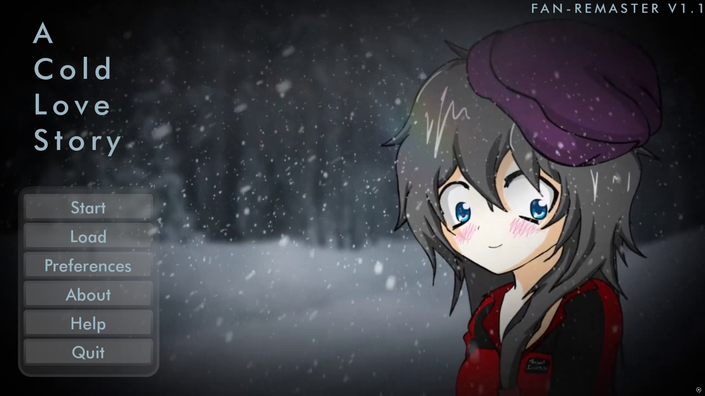

# A Cold Love Story Remaster

---

### About

**A Cold Love Story Remaster** is a fan restoration project of *A Cold Love Story* — a visual novel originally created by **Liam Vickers** in 2015 and left unfinished.  
Our goal is to bring the game back to life with modern Ren’Py support, new translations, and improved accessibility.

---

### 🛠 Technical Details

- **Engine:** Ren’Py 8.3.7 (updated from 6.99)
- **Platforms:** Windows & Android
- **Languages:**
    - English *(Original)*
    - Russian *(Translated by Ponder_Static)*
    - Brazilian Portuguese *(Translated by Nucita)*

The game also includes readable versions of the original side stories:
- *A Cold Love Story Reboot*
- *A Cold Love Story Retold [1/2]*
- *A Cold Love Story Retold [2/2]*

These can be accessed directly in-game.

---

### 📦 Installation

1. Download and install **[Ren'Py 8.3.7](https://www.renpy.org/)**.
2. Download the **source code** from the [Releases page](https://github.com/RootTool0/ACLS_DEV/releases).
3. Before launching, run the included **`DownloadAssets.bat`** file once — it will automatically fetch the additional video assets (>100 MB) that are not stored in the repository.
4. Launch the project through Ren’Py.

---

### 🧩 Releases

- **[v1.1](https://github.com/RootTool0/ACLS_DEV/releases/tag/V1.1)** – First public release
  - Cleaned up unnecessary files for better optimization _(size reduced from 2.5 GB to 2 GB)_
  - Updated UI design _(Thanks to At0m)_
  - Fixed translations _(Thanks to Ponder_Static)_

- **[v1.2](https://github.com/RootTool0/ACLS_DEV/releases/tag/V1.2)** – Updated and expanded build
  - Added three original stories related to the visual novel:
    - *ACLS Reload*
    - *ACLS Retold [1/2]*
    - *ACLS Retold [2/2]*  
  
  - Languages: Each story is available in **English** _(original)_ and **Russian** _(translated by Ponder_Static)_

You can find all releases here:  
👉 [A Cold Love Story Remaster Releases](https://github.com/RootTool0/ACLS_DEV/releases)

---

### 👥 Team (Made with love by community)

- **RootTool** — Programming & backend
- **At0m** — Main menu designer
- **Ponder_Static** — Project initiator & Russian translation
- **Nucita** — Brazilian Portuguese translation

---

### ⚖️ Credits & Rights

All rights to the original **A Cold Love Story** belong to **Liam Vickers**.  
This is a **non-commercial fan restoration project**, created out of respect and admiration for the original work.

---

### 🧊 Additional Notes

Optional assets (such as large video files) are available in the  
[**Extra Assets Release**](https://github.com/RootTool0/ACLS_DEV/releases/tag/Extra-Assets).  
You can safely ignore it if you already have the full project downloaded.

---

### 📬 Contact

- **Our Telegram Channel:** [SSTWL CIS](https://t.me/SSTWLRUS)
- **Our YouTube Channel:** [SSTWL RUS](https://www.youtube.com/@SSTWL_RUS)
- **RootTool's Telegram Channel:** [RootTool Blog](https://t.me/RootToolBlog)

### 💬 Or you can contact us directly (Discord / Telegram):

- **Ponder_Static:** `.ponder_static` / [@Ponder_Static](https://t.me/Ponder_Static)
- **RootTool:** `.roottool` / [@RootTool28](https://t.me/RootTool28) *(not very good at English, sorry!)*

